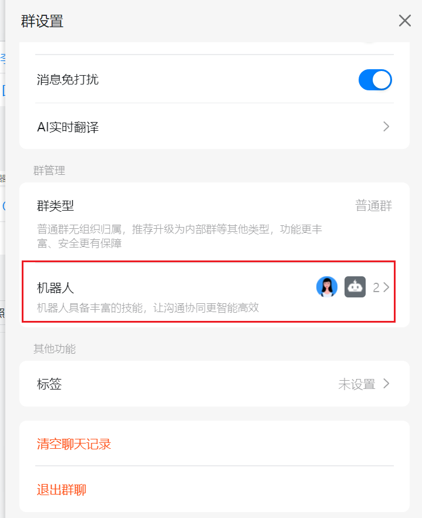
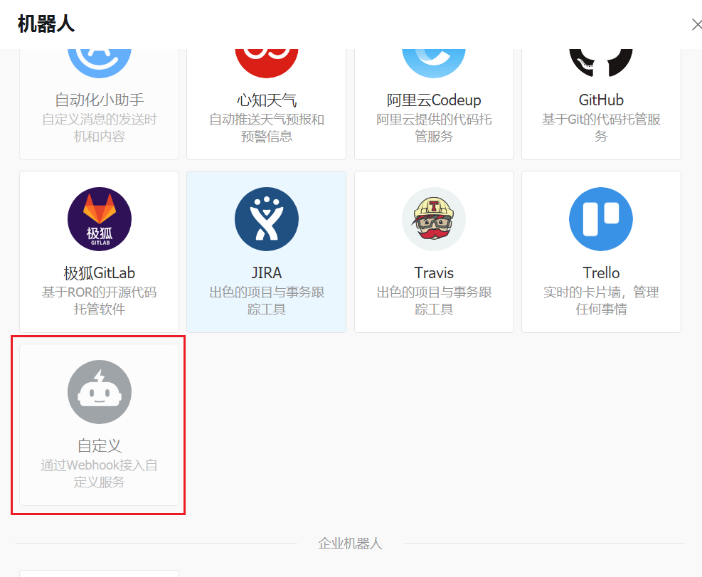
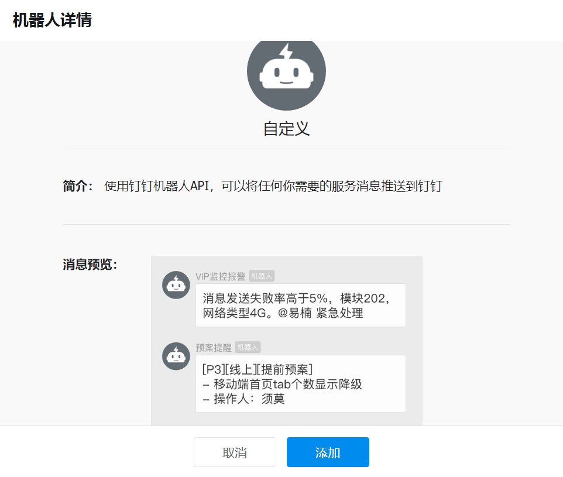
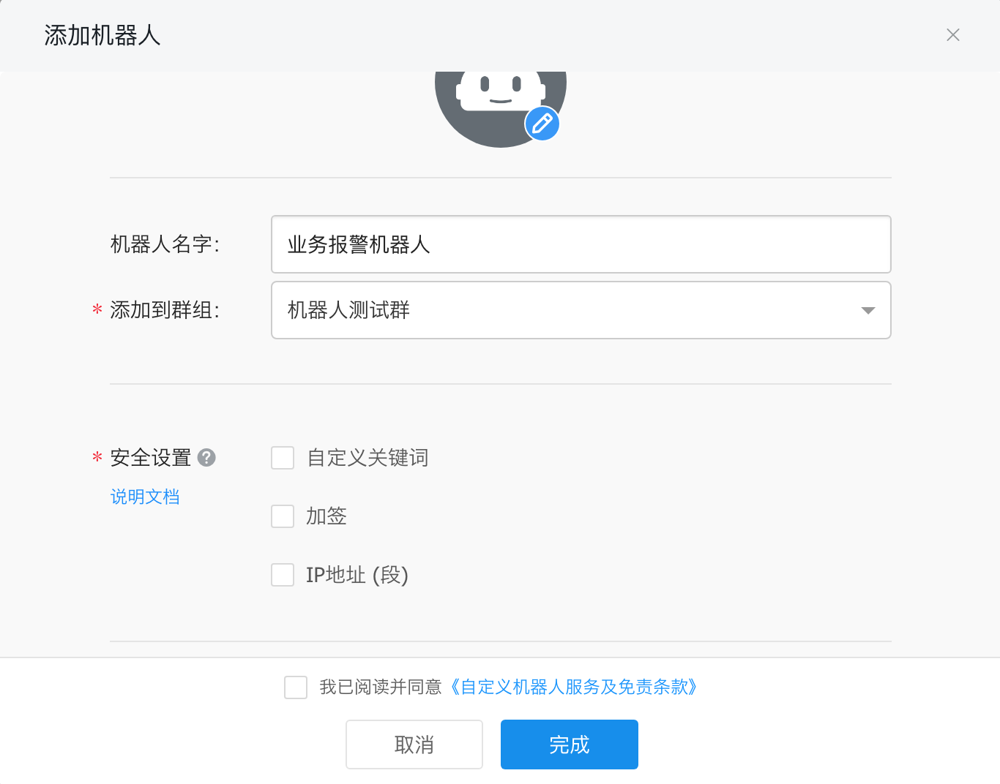
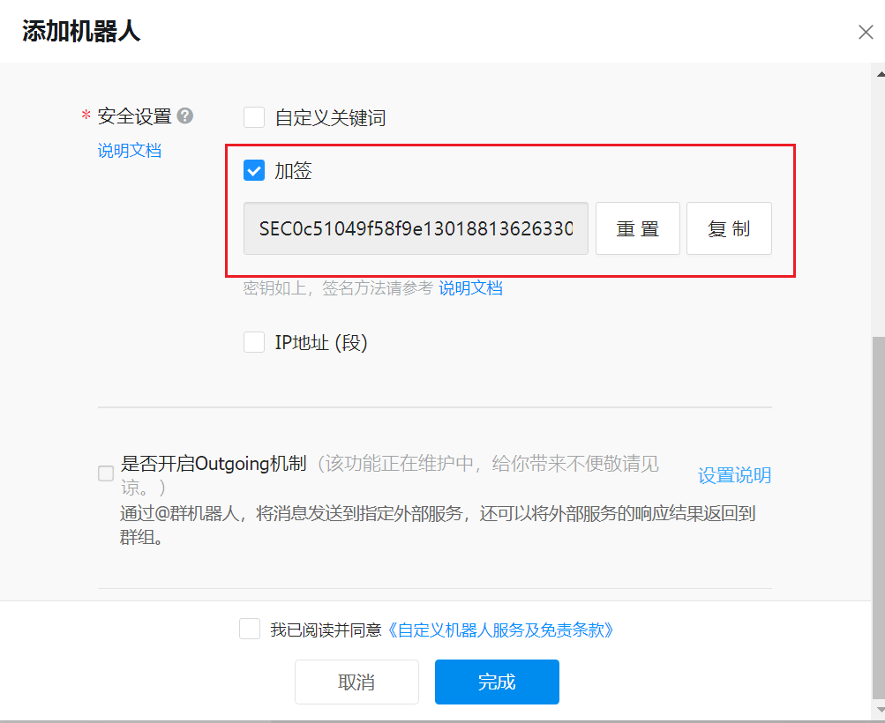
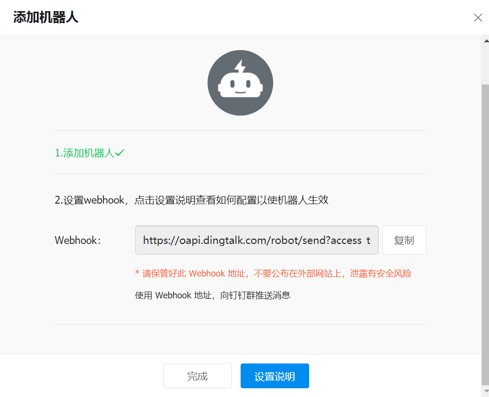
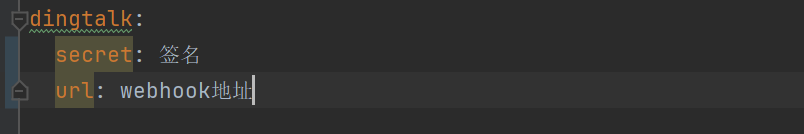
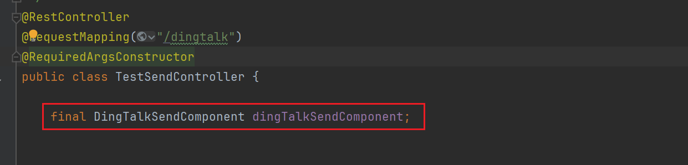
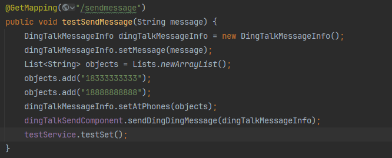

# dingding-message-sdk

#### 介绍
dingding-message-sdk - 钉钉消息发送SDK

#### 使用说明

1.  在钉钉群组中新建机器人
    （钉钉在2023年8月4日发出新规：自定义机器人只能在内部群中新建，所以要设置群场景为内部群）

    路径为：群聊->群设置->机器人

    

    添加机器人，选择自定义机器人

    

    

2.  设置机器人

    

    安全设置选择加签（目前此SDK仅支持加签的模式）

    

    复制出签名后续需要配置在配置文件中
    
    保存好签名后点击完成

    

    这里需要记录webhook地址，同样需要在配置文件中配置

3.  在需要发送钉钉通知的项目中引入依赖

    <dependency>
        <groupId>com.vison</groupId>
        <artifactId>dingtalk-sdk</artifactId>
        <version>1.0.0</version>
    </dependency>
    
4.  配置文件中新增配置：
 
        dingtalk:
           secret: 签名
           url: webhook地址
    
    示例如下：

    

5.  使用方式：

    在需要使用的service中注入bean

    

    新建消息实体 DingTalkMessageInfo
    
    message 为需要发送的消息
    
    atPhones 为需要@的人 如果不传atPhones则默认@所有人

    

    